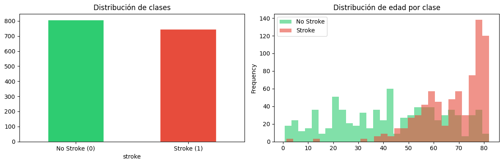
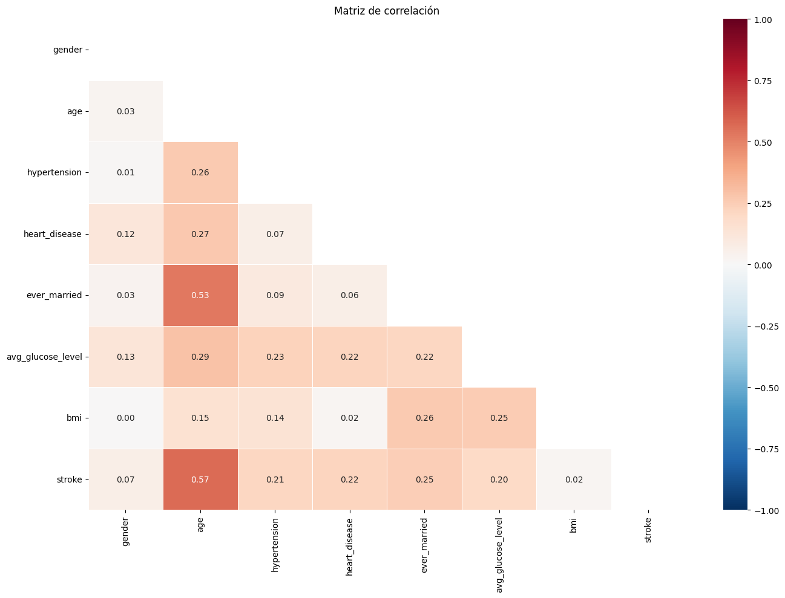
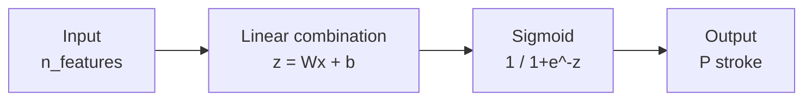
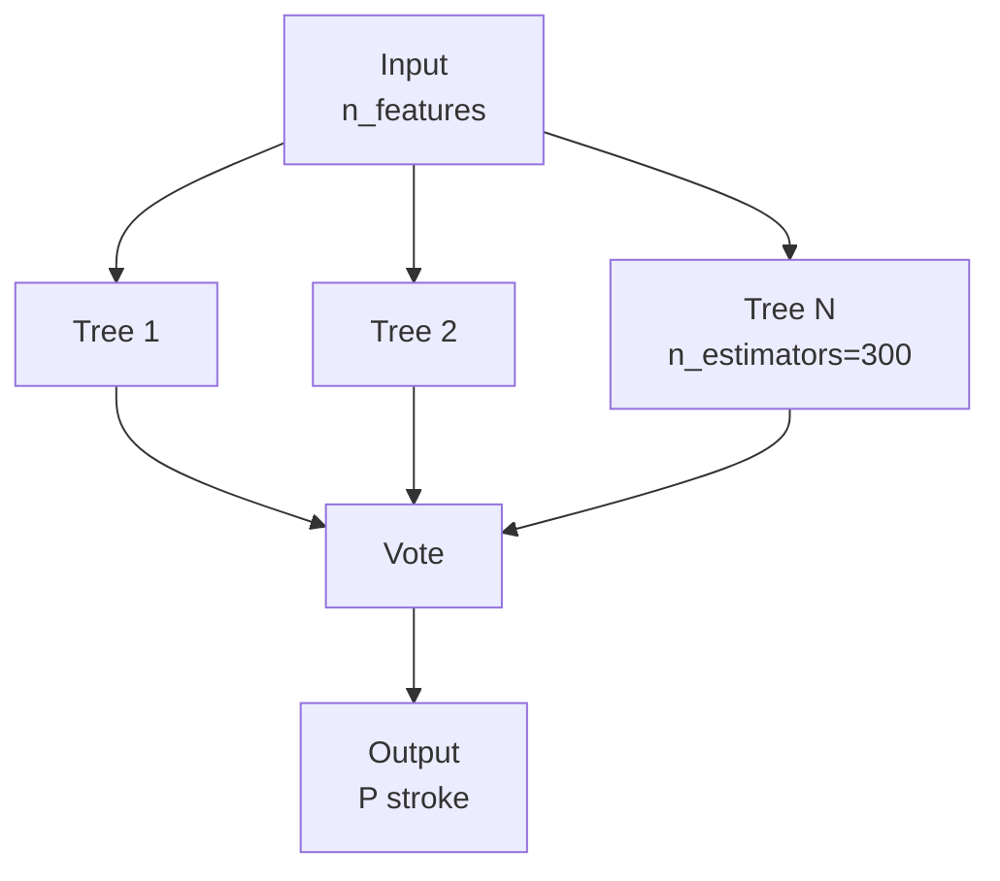
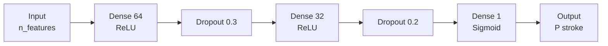
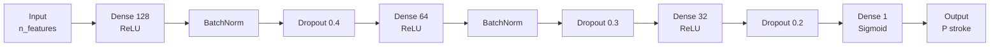
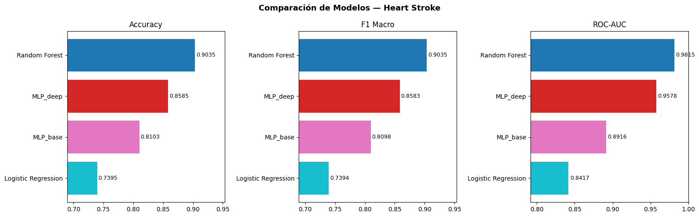

# Stroke Prediction: Predicción de accidente cerebrovascular

Angel Mauricio Ramírez Herrera | A01710158

El objetivo de este proyecto es predecir si un paciente puede sufrir un accidente cerebrovascular a partir de variables clínicas y demográficas. Se comparan cuatro enfoques: dos modelos de machine learning clásico y dos redes neuronales densas.

La estructura de entrenamiento y guardado de modelos está basada en mi repositorio hecho para la clasificación de género de canciones por la estructura de la letra: SongTextClassifier. GitHub: https://github.com/Angeltrek/SongTextClassifier

---

### Base de la investigación

La selección de modelos y el diseño experimental están sustentados en trabajos previos de la literatura. Asadi et al. (2023) evaluaron cinco algoritmos supervisados sobre un dataset clínico de stroke de Kaggle, encontrando que Logistic Regression y Gradient Boosting alcanzaron la mayor accuracy (95.11%) y ROC-AUC (0.836), aunque todos los modelos mostraron un recall bajo para la clase positiva debido al desbalance de clases. Su análisis de importancia de features con Random Forest identificó la edad, el nivel de glucosa promedio y el BMI como los predictores más influyentes, lo que coincide con la Hipótesis del Síndrome Metabólico y con hallazgos epidemiológicos previos. Este resultado motivó incluir esas tres variables como las más relevantes en el análisis exploratorio de este proyecto y confirmó que el desbalance de clases es el principal obstáculo a resolver antes de entrenar cualquier modelo.

Para las redes neuronales densas, el diseño de las capas y el uso de BatchNormalization como técnica de regularización se apoya en Trigka y Dritsas (2023), quienes aplicaron arquitecturas similares sobre datos clínicos tabulares de predicción cardiovascular y demostraron que la normalización por lotes acelera la convergencia y mejora la generalización en datasets de tamaño moderado.

La elección de F1 Macro y ROC-AUC como métricas principales en lugar de accuracy sigue la recomendación de Sokolova y Lapalme (2009), quienes argumentan que en problemas de clasificación con clases desbalanceadas el accuracy es una métrica insuficiente porque no refleja el desempeño real sobre la clase minoritaria.

---

## Dataset

| Variable          | Descripción                         |
| ----------------- | ----------------------------------- |
| age               | Edad del paciente                   |
| hypertension      | Hipertensión (0/1)                  |
| heart_disease     | Enfermedad cardíaca (0/1)           |
| ever_married      | Estado civil                        |
| work_type         | Tipo de trabajo                     |
| Residence_type    | Tipo de residencia                  |
| avg_glucose_level | Nivel promedio de glucosa           |
| bmi               | Índice de masa corporal             |
| smoking_status    | Tabaquismo                          |
| stroke            | Variable objetivo (1 = tuvo stroke) |

---

## Análisis exploratorio

La variable bmi tiene valores faltantes. En lugar de imputar con la media o mediana global, se imputa por grupo de género y edad porque el IMC varía considerablemente entre distintos grupos demográficos.

Las variables categóricas se convierten a formato numérico mediante one-hot encoding. Las variables continuas se normalizan con Z-score para que ninguna domine el gradiente por tener una escala numéricamente más grande que las demás.

| bmi | 135 |
| dtype: | int64 |

El dataset tiene clase desbalanceada, con alrededor del 52% de los casos sin stroke y solo el 48.07% con stroke. Esto es clínicamente realista pero implica que el accuracy por sí solo no es suficiente para evaluar el modelo, ya que un clasificador trivial podría obtener métricas altas sin aprender patrones reales. Por esta razón se reportan F1 Macro y ROC-AUC como métricas principales.

Se observa que probablemente existe una correlación entre la edad y la presencia de stroke, lo que es coherente con los factores de riesgo documentados clínicamente.

---

## Funciones de evaluación

Se reportan accuracy, F1 Macro, F1 Weighted y ROC-AUC. Con clases desbalanceadas como este dataset, la métrica más relevante es ROC-AUC porque mide qué tan bien el modelo separa las dos clases independientemente del umbral de decisión.

---

## Matriz de correlación

Se analizó la correlación entre variables para identificar multicolinealidad y para entender qué variables tienen mayor relación con la variable objetivo. Se detecta que efectivamente existe una correlación positiva entre stroke y age, lo que confirma la observación del análisis exploratorio. Variables como work_type y ever_married tienen correlación implícita con la edad, lo que puede introducir redundancia en el modelo.

---

## Arquitecturas

### Logistic Regression

### Random Forest

### MLP base

### MLP con BatchNormalization

---

## Resultados

| Modelo                 | Accuracy | F1 Macro | ROC-AUC | Tiempo |
| ---------------------- | -------- | -------- | ------- | ------ |
| Random Forest mejorado | 0.9550   | 0.9549   | 0.9885  | 0.82s  |
| Random Forest          | 0.9035   | 0.9035   | 0.9815  | 0.81s  |
| MLP deep               | 0.8328   | 0.8328   | 0.9359  | 19.13s |
| MLP base               | 0.7814   | 0.7805   | 0.8664  | 14.61s |
| Logistic Regression    | 0.7395   | 0.7394   | 0.8417  | 0.01s  |

El Random Forest fue el modelo con mejor desempeño en todas las métricas. Esto es consistente con lo que reporta la literatura para datasets clínicos tabulares de tamaño reducido, donde los modelos de ensamble de árboles tienden a superar a las redes neuronales porque no necesitan grandes volúmenes de datos para generalizar bien. El Random Forest mejorado, con mayor profundidad máxima, incrementó el ROC-AUC a 0.9885 y la accuracy a 0.9550, lo que confirma que el modelo base tenía margen para capturar más patrones sin llegar a sobreajuste significativo.

La regresión logística obtuvo el menor rendimiento pero sigue siendo el modelo más interpretable clínicamente: sus coeficientes indican directamente qué variables aumentan o reducen el riesgo, lo que tiene valor en un contexto médico donde la explicabilidad importa tanto como la precisión.

Las redes neuronales quedaron en un punto intermedio. El MLP con BatchNormalization superó al MLP base en todas las métricas, lo que sugiere que la normalización de las activaciones ayuda a la convergencia en este tipo de datos. Sin embargo, ambas redes tardaron entre 15 y 20 veces más en entrenar que el Random Forest sin lograr superarlo.

El feature más relevante según el Random Forest fue la edad, seguido del nivel de glucosa promedio y el BMI, lo cual es coherente con los factores de riesgo documentados clínicamente para el accidente cerebrovascular.

---

## Instalación

### Requisitos previos

Python 3.10, 3.11 o 3.12 instalado en el sistema. Para verificar:

python --version

### Windows

python -m venv venv
venv\Scripts\activate
pip install -r requirements.txt

### macOS / Linux

python3 -m venv venv
source venv/bin/activate
pip install -r requirements.txt
Para desactivar el entorno:

## deactivate

## Estructura del proyecto

stroke-prediction/
├── predict.py
├── requirements.txt
├── README.md
└── models/
├── rf_improved_model.pkl
└── MLP_deep.keras

---

## Uso

Paciente completamente aleatorio:

python predict.py --models ./models --random
Modo interactivo (presiona Enter en cualquier campo para usar un valor aleatorio):

python predict.py --models ./models --interactive
Con argumentos directos:

python predict.py --models ./models --age 72 --gender Male --hypertension 1 --heart_disease 1 --ever_married Yes --work_type Private --residence_type Urban --avg_glucose_level 228.0 --bmi 36.6 --smoking_status "formerly smoked"

---

## Referencias

Ramírez Herrera, A. M. (2024). SongTextClassifier: Evidencia de deep learning para Inteligencia Artificial Avanzada para la Ciencia de Datos II. GitHub. https://github.com/Angeltrek/SongTextClassifier

Heart Stroke Dataset. Kaggle. https://www.kaggle.com/datasets/madhavtesting/heart-stroke-dataset

Sokolova, M., & Lapalme, G. (2009). A systematic analysis of performance measures for classification tasks. Information Processing & Management, 45(4), 427–437. https://doi.org/10.1016/j.ipm.2009.03.002

Asadi, H., et al. (2023). Evaluating machine learning models for stroke prediction based on clinical variables. Frontiers in Neurology. https://doi.org/10.3389/fneur.2025.1668420
